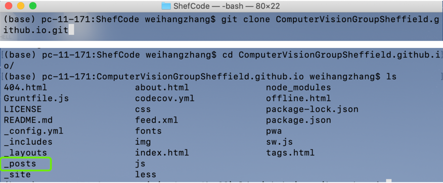
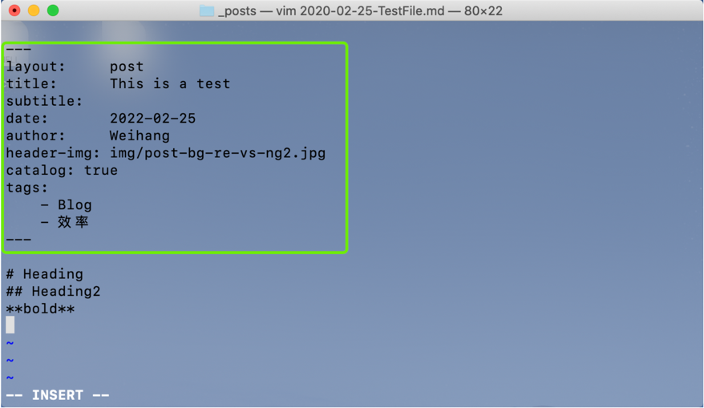

>how to use this website - posting 

## 1. Clone this Project with git

Open  **terminal** in mac or **cmd** in windows

Clone our project and go into the folder

```shell
git clone git@github.com:ComputerVisionGroupSheffield/ComputerVisionGroupSheffield.github.io.git
cd ComputerVisionGroupSheffield.github.io.git
```

Then checkout your own branch
```shell
git checkout -b weihangdebranch
```



## 2. Add or edit the .md file in _post folder

then we go into the **_post** folder

```shell
cd _post
```

and then new a markdown file 

```shell
touch 2020-2-5-TestFile.md
vim 2020-2-5-TestFile.md # you can open with your preferable editor
```

**!!!**  It is really import that we shoud obey the layout in the **top part**, The **key information** should be included. 




Then press **ESC**, then save and quit.

```shell
:wq
```


## 3. Commit your changes

```shell
cd ..  #  go back to parent folde
git add _posts  # git add the _post folder
git commit -m 'short description about the commit'
```

```shell
git push # if you are using a remote branch
git push --set-upstrean origin weihangdebranch # if you've new a local branch & want push
```

## 4. Tell the code manager 
Tell weihang to merge your code 😀😀

Then your new article will show up in our website!!